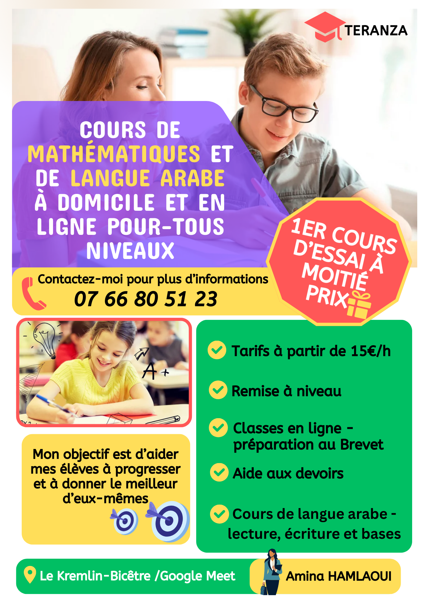

# aminahamlaoui.github.io
Site de présentation et de ressources en ligne, créé avec GitHub Pages
<!DOCTYPE html>
<html lang="fr">
<head>
  <meta charset="UTF-8">
  <title>Teranza – Entreprise multifonctionnelle</title>
  
  

</head>
<body>

<header>
  <h1>Teranza</h1>
  
Entreprise multifonctionnelle

</header>

<section>
  <h2>Présentation</h2>
  

    Teranza est une entreprise multifonctionnelle proposant des services variés
    dans le domaine de la formation et de l’accompagnement éducatif.
    Notre objectif est d’offrir des solutions adaptées aux besoins des élèves et des familles.
  

</section>

<section>
  <h2>Teranza Learning</h2>
  

    Teranza Learning est le pôle formation de Teranza.
    Nous proposons un accompagnement pédagogique personnalisé pour aider les élèves
    à progresser et à réussir.
  

  <h3>Nos cours</h3>
  <ul>
    <li>Cours particuliers en mathématiques</li>
    <li>Cours d’arabe</li>
    <li>Aide aux devoirs (primaire, collège)</li>
  </ul>
</section>
<section class="flyer">
  <h2>Notre Flyer</h2>
  
Découvrez nos services de formation et d’accompagnement.

  
</section>
<section class="contact">
  <h2>Contact</h2>
  

    📞 Téléphone : <strong>07 66 80 51 23</strong> 
    📍 Cours à domicile ou à distance (selon besoins)
  

</section>

<footer>
  © 2025 Teranza – Teranza Learning | Tous droits réservés
</footer>

</body>
</html>

